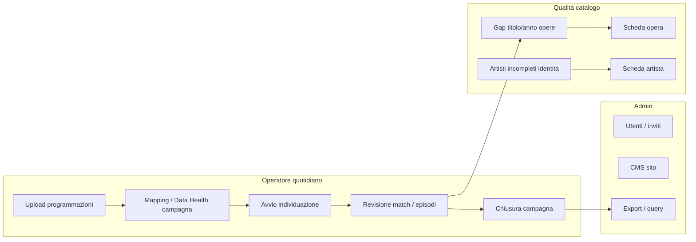

# Proposta layout Dashboard home — wireframe a sezioni

**Data:** 2026-07-31  
**Stato:** Implementato (home redesign v1 + Data Health impatto)  
**Branch:** `cursor/dashboard-data-health-individuazione-02bc`  
**Scope:** solo `/dashboard` (home operatori/admin). Fuori scope: restyling sidebar, area artista, redesign pagine figlie.

## Problema

La home attuale mescola KPI vanity, feed, export banca dati e Data Health senza gerarchia. L’operatore non vede subito *cosa fare*, né quali gap catalogo bloccano l’individuazione.

## Obiettivo

Ridisegnare l’information architecture della home su **flussi reali** (import → matching → revisione → ripartizione / qualità catalogo), applicando i 5 punti emersi + Data Health orientato all’individuazione.

## I 5 punti + Data Health

| # | Principio | Traduzione in layout |
|---|---|---|
| 1 | IA a zone, non restyling | 3 zone fisse: Attenzione → Andamento → Qualità |
| 2 | KPI compatti | 4 metriche operative, non 6 card + doppio blocco totali |
| 3 | Grafici solo se spiegano andamento | 1–2 trend (matching, programmazioni); niente chart vanity |
| 4 | Export fuori dalla home | CTA secondaria verso Report/Query; export XLSX non in viewport 1 |
| 5 | Action-oriented | Coda lavoro cliccabile verso programmazioni / individuazioni / catalogo |
| + | Data Health individuazione | Priorità campi matching (opere) vs identità/anagrafica (artisti) |

## Flussi reali da servire



Ruoli sulla home:

- **Operatore + Admin:** zone 1–3 (attenzione, andamento, qualità).
- **Solo Admin:** chip/azioni opzionali (utenti da invitare, CMS) in zona 1 come item secondari, non KPI.

## Wireframe complessivo (desktop)

```
┌─ Sidebar (invariata) ─┬──────────────────────────────────────────────────────┐
│ Dashboard             │  HEADER                                              │
│ Artisti               │  Panoramica operativa · {mese}          [Ruolo chip] │
│ Opere                 │                                                      │
│ Programmazioni        │  ┌────────┐ ┌────────┐ ┌────────┐ ┌────────┐         │
│ Individuazioni        │  │ Camp.  │ │ Match  │ │ Prog.  │ │ Importo│  KPI×4 │
│ Ripartizioni          │  │ attive │ │ mese % │ │ mese   │ │ distr. │         │
│ Query                 │  └────────┘ └────────┘ └────────┘ └────────┘         │
│ Utenti*               │                                                      │
│ CMS*                  │  ═══ ZONA 1 · RICHIEDE ATTENZIONE ═════════════════  │
│                       │  ┌─────────────────────────────────────────────────┐ │
│                       │  │ Coda lavoro (max 5–7 item, severità)            │ │
│                       │  │ • N match da revisionare          → Individuaz. │ │
│                       │  │ • N upload / campagne in errore   → Programmaz. │ │
│                       │  │ • N campagne individuazione aperte → Individuaz.│ │
│                       │  │ • Gap critici matching opere      → Data Health │ │
│                       │  │ • (admin) Inviti / utenti pending → Utenti      │ │
│                       │  └─────────────────────────────────────────────────┘ │
│                       │                                                      │
│                       │  ═══ ZONA 2 · ANDAMENTO ═══════════════════════════  │
│                       │  ┌──────────────────────┐ ┌──────────────────────┐   │
│                       │  │ Trend matching 30gg  │ │ Attività recenti     │   │
│                       │  │ [spark/line chart]   │ │ (feed compatto,      │   │
│                       │  │ + delta vs mese prec │ │  link a dettaglio)   │   │
│                       │  └──────────────────────┘ └──────────────────────┘   │
│                       │                                                      │
│                       │  ═══ ZONA 3 · QUALITÀ DATI ════════════════════════  │
│                       │  ┌─────────────────────────────────────────────────┐ │
│                       │  │ DATA HEALTH (sintesi + legenda impatto)         │ │
│                       │  │ Gap matching opere | Artisti | Completamento    │ │
│                       │  │ Opere: Critico/Utile matching (ordinati)        │ │
│                       │  │ Artisti: Identità / Anagrafica                  │ │
│                       │  │ [Vedi opere incomplete] [Vedi artisti incompleti]│ │
│                       │  └─────────────────────────────────────────────────┘ │
│                       │                                                      │
│                       │  footer secondario: Esporta banca dati · Query      │
└───────────────────────┴──────────────────────────────────────────────────────┘
```

Mobile: KPI in griglia 2×2; zone in stack verticale; coda lavoro full-width; chart sotto la coda; Data Health collassabile a sezioni Opere/Artisti.

---

## Sezione per sezione

### 0. Header

| Elemento | Contenuto |
|---|---|
| Titolo | Panoramica operativa |
| Sottotitolo | Periodo corrente (mese) + eventuale last refresh |
| Rimuovere | Badge “Sistema Operativo” (rumore) |

### 1. KPI strip (punto 2)

Quattro card compatte, una riga, click → destinazione rilevante:

| KPI | Perché | Link |
|---|---|---|
| Campagne individuazione in corso | carico operativo | `/dashboard/individuazioni` filtrato |
| Tasso matching (periodo) | qualità matching | dettaglio individuazioni / chart zona 2 |
| Programmazioni mese | volume ingest | `/dashboard/programmazioni` |
| Importo distribuito | esito ripartizione | `/dashboard/ripartizioni` |

**Fuori dalla strip:** totali artisti/opere/record DB, “Report attivi” ridondante con campagne, blocco “Statistiche Sistema”.

### 2. Zona 1 — Richiede attenzione (punti 1, 5)

Una sola card lista. Ogni riga: icona severità · testo · conteggio · deep-link.

Priorità suggerita:

1. **Revisione matching** — individuazioni in coda review / episodio mancante / score basso  
2. **Import o job falliti** — upload programmazioni error / jobs interrupted  
3. **Campagne da chiudere** — individuazione `in_corso` da troppo tempo  
4. **Gap critici matching** — titolo/anno opere (ancora a Data Health)  
5. **Admin-only** — inviti utente pending (se `canManageUsers`)

Empty state: “Nessuna azione urgente” + CTA “Apri programmazioni”.

Non usare card separate per ogni tipo di alert (rumore).

### 3. Zona 2 — Andamento (punto 3)

Due colonne:

**A. Trend matching (unico chart obbligatorio nella v1)**  
- Serie 30 giorni: tasso o volume individuazioni valide vs totali  
- Micro-copy: “Utile per capire se un import recente ha peggiorato il matching”  
- Chart opzionale secondario (v1.1): volume programmazioni caricate / settimana  

**B. Attività recenti**  
- Stesso feed attuale ma compatto, con link a scheda (artista/opera/campagna)  
- Max 5 item; niente background colorati per-tipo a piena larghezza

Se i dati trend non sono ancora disponibili via RPC: placeholder “Trend in arrivo” senza inventare chart fake.

### 4. Zona 3 — Data Health (punto +)

Allineata al lavoro già in PR (#14 / classificazione impatto):

```
┌─ Data Health ──────────────────────────────────────────────┐
│ Legenda: Critico matching | Utile matching | Identità | Anagrafica │
│ Nota: matching = programmazioni → opere → partecipazioni → artisti │
│                                                                │
│ [Gap matching opere: N campi] [Artisti incompleti] [Completamento]│
│                                                                │
│ Opere — segnali individuazione     Artisti — identità/anagrafica│
│ ● Titolo          Critico   ██░    ● Nome     Identità          │
│ ● Anno produzione Critico   ██░    ● Cognome  Identità          │
│ ● Tipo            Utile     ███    ● IPN      Anagrafica        │
│ ● IMDB tconst     Utile     …      …                            │
│ ● Titolo orig.    Utile     …                                   │
│                                                                │
│ [Filtra opere incomplete]          [Filtra artisti incompleti]  │
└────────────────────────────────────────────────────────────────┘
```

Regole UI:

- Ordine per impatto (già implementato).
- Opere a sinistra (o sopra su mobile): focus matching.
- Artisti con copy esplicito: *non guidano il match titolo*.
- CTA verso liste filtrate (query param o filtro salvato) — non solo barre %.
- **Non** includere export XLSX in questa zona.

Estensione futura (fuori v1 layout): aggiungere metrica **Regista** (discriminante matching) e gap episodi serie.

### 5. Azioni secondarie / export (punto 4)

Fuori dal first viewport, riga footer:

- `Esporta banca dati` (dialog/progress già esistente)  
- `Apri Query` → `/dashboard/query`  
- Eventuale ripristino `/dashboard/report` come hub export (oggi redirect alla home)

---

## Mapping “oggi → proposto”

| Blocco attuale | Destino |
|---|---|
| 6 KPI card | 4 KPI strip |
| Statistiche Sistema | Eliminato (ridondante) |
| Attività recenti | Zona 2B compatta |
| Export Banca Dati (card grande) | Footer secondario / Report |
| Data Health generico | Zona 3 con impatto individuazione (in corso) |
| Badge Sistema Operativo | Rimosso |
| (mancante) coda lavoro | Zona 1 nuova |
| (mancante) trend | Zona 2A nuova |

## Vincoli implementativi

- Home resta in `src/app/dashboard/page.tsx` sottile; sezioni in `src/features/dashboard/components/*`.
- Riutilizzare `get_dashboard_metrics` + estensioni RPC solo dove servono conteggi coda/trend (caution: migrations).
- Nessuna nuova libreria chart finché non c’è serie temporale reale; valutare sparkline CSS/SVG minima prima di Recharts.
- Rispettare ruoli: artisti non vedono questa home (walled garden profilo).
- Non mischiare questo refactor con migrazione namespace UI (`docs/ARCHITECTURE.md`).

## Criteri di accettazione (proposta)

1. Above-the-fold: header + KPI×4 + almeno 1 item coda (o empty state azione).  
2. Nessun export full-DB sopra Data Health.  
3. Data Health mostra legenda impatto e priorità opere matching.  
4. Ogni item coda e ogni CTA health ha destinazione reale.  
5. Max un chart trend in v1; assenza dati → empty esplicito, non zero finti.

## Fasi suggerite

1. **IA + Data Health** — rimuovere ridondanze, KPI×4, footer export, health già classificato (parziale in branch corrente).  
2. **Coda attenzione** — conteggi review/errori/campagne + deep-link.  
3. **Trend** — RPC/serie matching 30gg + sparkline.  
4. **Liste filtrate** — artisti/opere incomplete da CTA health.

## Aperto a validazione

1. Quali stati individuazione contano come “da revisionare” in coda (solo review queue vs anche episodio_mancante)?  
2. Il KPI “importo distribuito” resta in home o si sposta su Ripartizioni?  
3. Serve un chart programmazioni già in v1 o solo matching?
